## 去长沙，说走就走

> 一场说走就走的旅行～

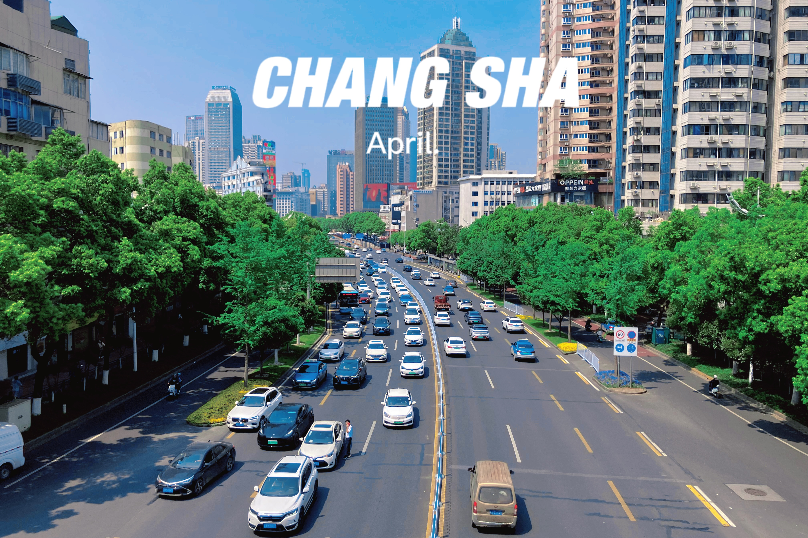

这是一篇随想，无甚逻辑，只有彼时此地的随想。

一个人在寝室，大声外放音乐，一字一句敲下，心情飞回4月12日～

4月6日，试试看抢到了邓紫棋长沙站的票，来了一场说走就走的旅行！～

4月11日晚，明知道第二天赶早班高铁前往长沙，仍然早睡失败，十二点过还睡不着，呵呵，直接担心早上起不起得来。

有多早呢，7点20分的高铁，从松江到虹桥，保守1.5小时地铁、1小时多打车，最晚6点出发，5点过得起床，前一天晚上必须收拾好。

收拾的时候还在拜天拜地，12号晚上别下雨，虽然别有乐趣，但真的不想变成落汤鸡。天气预报又全是下雨天，还需要带几件厚一点的衣服以防着凉。

最终，喜提6小时精致睡眠，打车前往高铁站。车上小憩。

在上高铁前展现J人本质，总共5小时车程，先在高铁上睡一觉自然醒，然后开始看两周后的期中考内容（没办法，4门专业课，平时又不怎么听课，不看不行，考前一两天看绝对来不及）。最后证明这个决定非常正确，唯一的问题就是高铁上睡的特别难受，根本没心情复习。

高铁上，半梦半醒间，人来人往，窗外景致确是大差不差，平原到丘陵，看过太多，无甚兴趣。直到经过株洲时，偶见一座坟，无比壮观，第一眼以为是一座土地庙，坐落于山丘半腰朝上。长长的阶梯蔓延而上，直抵坟前。短短5、6秒之间，无数思绪翻飞，这片土地下埋骨死去的亲人、族人、陌生人，他们生于此地，落地于此，最后作为一方山灵，长久地守望着这片土地，守此一方安宁，佑我一脉安康。

到达长沙。天气预报什么时候能准确一点，这么猛的太阳和气温，后悔带厚衣服了，还让我带了个箱子，后悔。

长沙南站太大，本想拍张照片留一个纪念，懒得走动，遂放弃。直接坐地铁奔赴酒店。

晚饭失策，一个人点单实在不知道吃些什么，本想尝试新的东西，结果鱼籽鱼泡根本吃不惯，辣度还好，主要鱼泡好腥啊。。果然我不适合吃鱼。
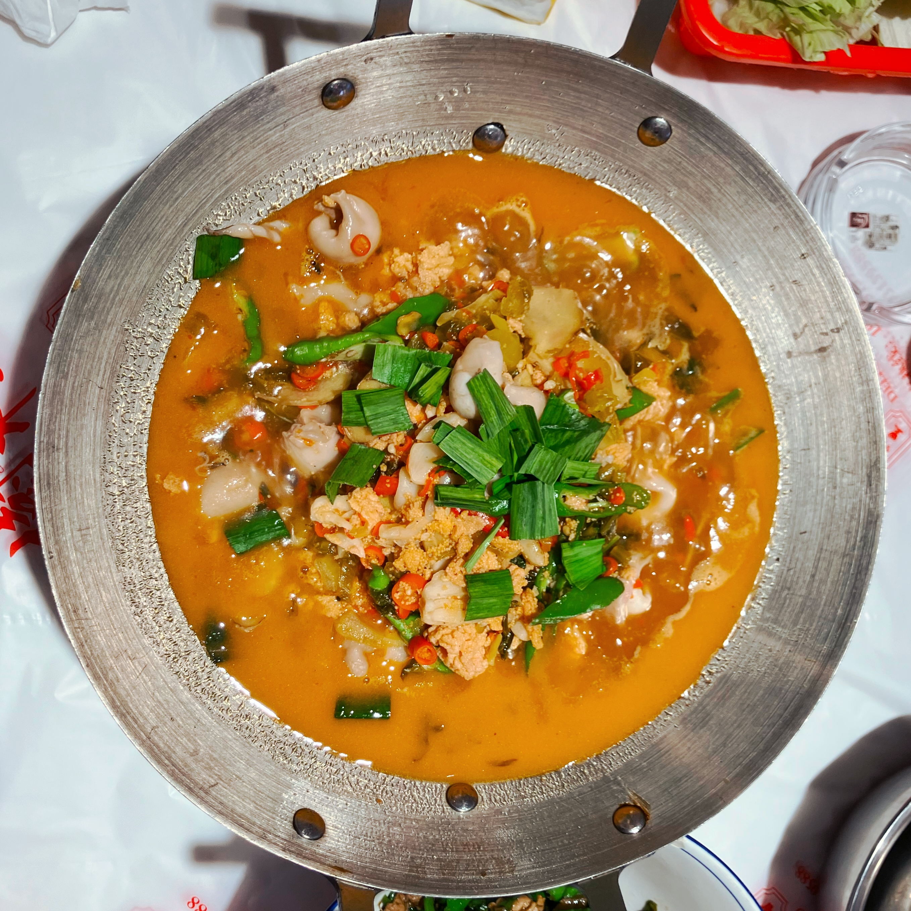

演唱会主办方真厉害，五道关口的安检，知道的我是去看邓紫棋的演唱会，不知道的以为我进了什么机密场所。本来想带着相机当回站姐，但为什么我跑了好几个口安检都很严，是因为内场？毕竟刷到帖子好多人都带进去了，工作人员挺好的，回过几道关口，终于放我出去回酒店放相机，幸好定的酒店离体育场就1km。给我惨的满头大汗。

看完了！好爽！长沙吃的真好！解解唱的真好！很嗨！开心死了！爽死了！“天空没有极限，我的未来无边”！

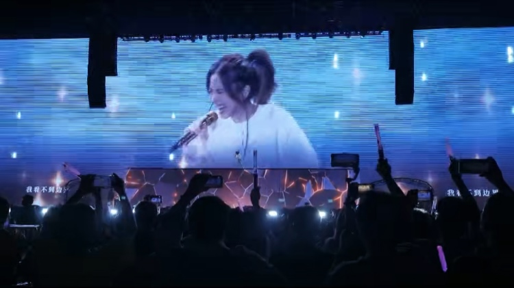

之后刷到后两天的帖子，我又难受了，后两场吃的更好，羡慕嫉妒。跟我看张杰28号那场一样，无论是对比上海其他场还是南昌，全都输麻了，南昌别吃的太好了。

嗓子哑完了，才想起润喉糖忘记带了，事后补救一下也是可以的吧。本来还想去逛夜市的，这一天实在太累，遂回房间看《快乐老友记》睡觉。

第二天又起个大早（其实也没多早，醒得早，但是赖床到快9点吃早饭），公交前往湖南博物院。看到一位奶奶满头华发，看精气神很好，而且头发好多（羡慕了），发型好酷，很像那种隐居的武林大佬。

博物院，我的精神食粮。以及，好多人，晕人了。
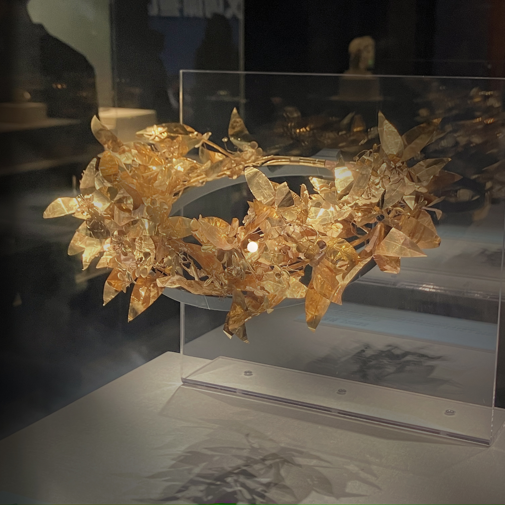

毛爷爷，看了！杜甫江阁，远观了！茶颜家族，喝了！糖油粑粑，吃了！臭豆腐，吃了！一路吃吃喝喝，真好呐！
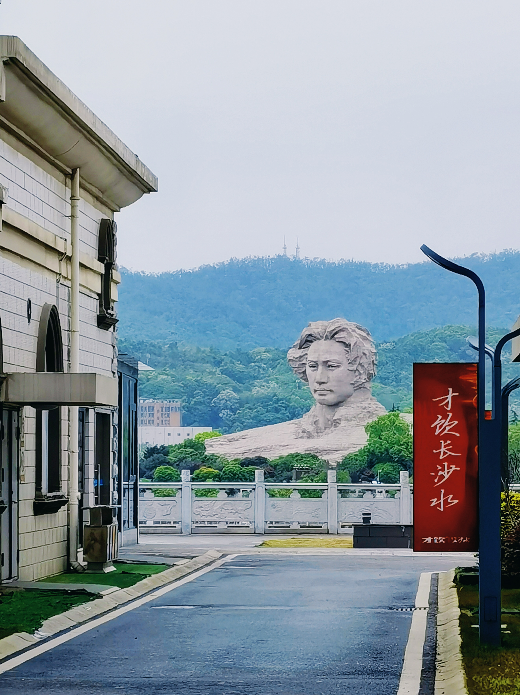
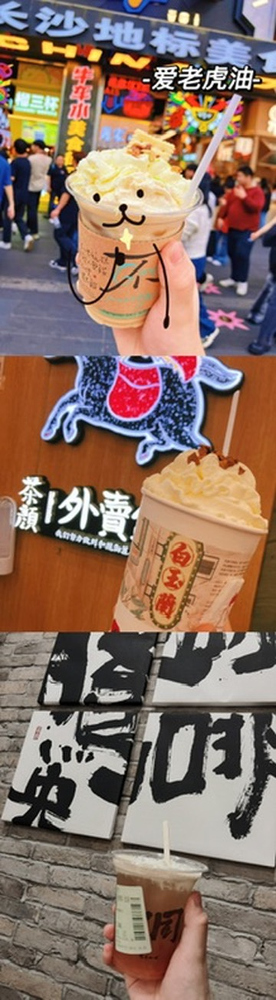

一个人的citywalk，一个人的狂欢与放纵。高楼与小巷，自由穿行其间，想在现代城市中寻找此地过往的记忆，又想在过去中寻找未来。

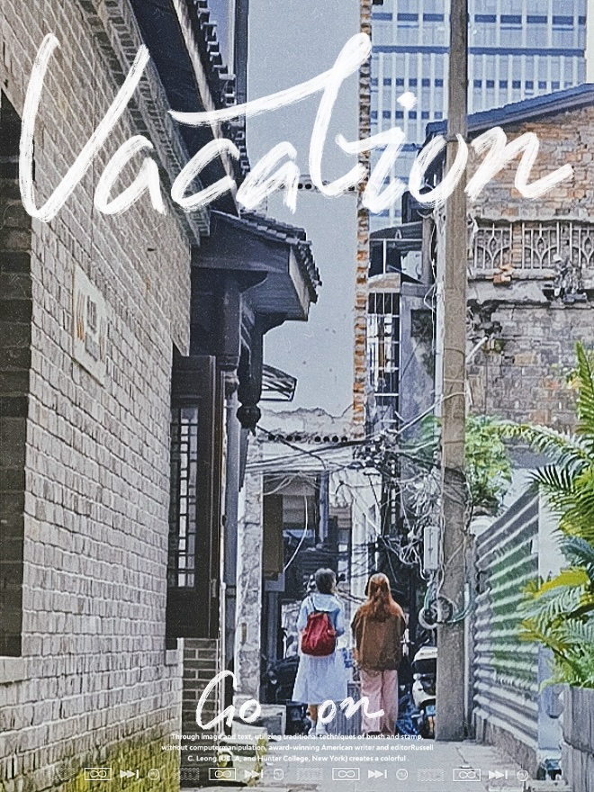

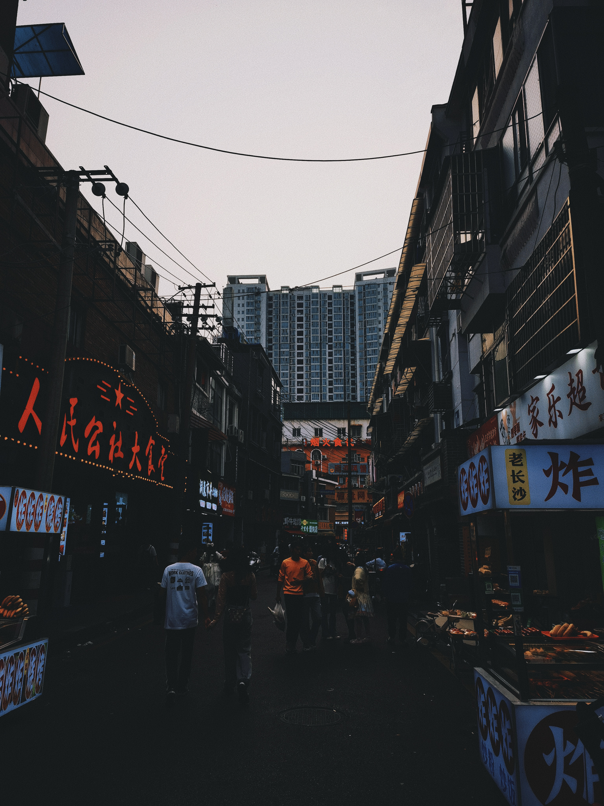

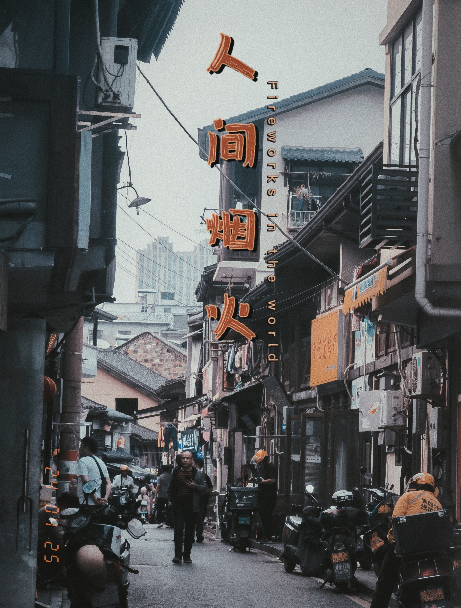

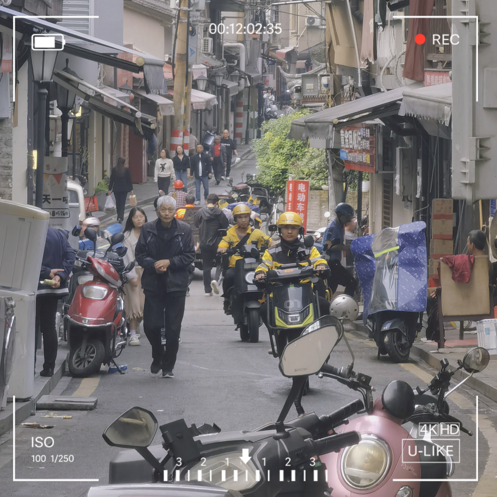

又一次乘坐绿皮火车，又是一个睡不着的夜晚，为什么不能“欺骗每个辗转难眠的夜”让我入睡？也确实，感觉最近的睡眠都很差，运动少了？还是在床上太久了？还是太焦虑了？anyway，十一点半下床看《财务报表分析》。家人们谁懂啊，竟然真的会有人半夜睡不着爬起来复习的，以前只当作段子，直到这件事真切地发生在我身上，才发觉，有点爽哈哈哈哈。窗外一片漆黑，火车疾驰，车厢摇晃，无人打扰，苹果信号又不好，复习效率嘎嘎高。
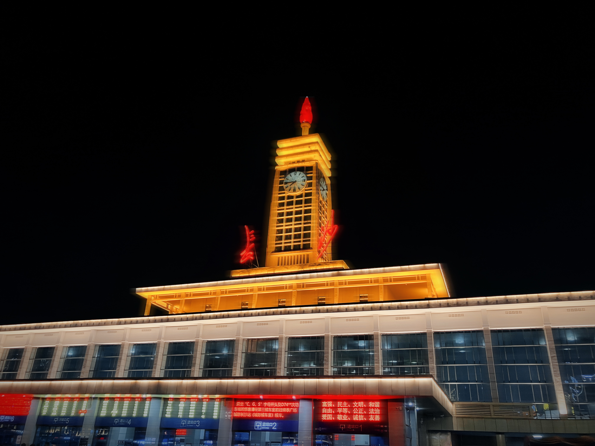

最后，2点上床，6点醒来准备下车。然后又买了张南站到松江的绿皮车。

长沙之行，结束。
